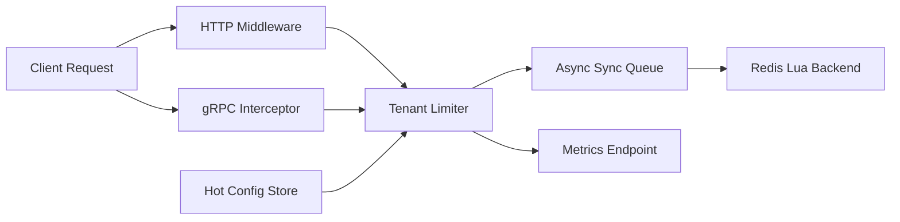

# Mesh Tenant Limiter

[](https://github.com/Viseriontarg/mesh-tenant-limiter/actions/workflows/ci.yml)
[](LICENSE)
[](go.mod)

`mesh-tenant-limiter` is a Go systems project exploring tenant-aware rate limiting in distributed environments. It is designed as a recruiter-friendly engineering artifact: small enough to run locally, but structured to show practical tradeoffs around latency, coordination, fail-open behavior, observability, and maintainability.

In one repository, it demonstrates:

- a working limiter with HTTP and gRPC integration points
- dynamic tenant-tier updates without process restarts
- a deterministic local simulation of noisy-neighbor and fail-open scenarios
- benchmarks, race coverage, and GitHub automation expected in a polished public project

## What This Repo Demonstrates

- Why naive per-node rate limiting fails in a multi-tenant mesh
- How to structure a Go limiter with clear package boundaries and testable interfaces
- How to expose hot configuration updates without process restarts
- How to handle backend outages with explicit fail-open behavior
- How to present tradeoffs honestly in a recruiter-friendly repository

## Current Scope

This repository is a strong prototype and demo, not a finished production control plane.

- Request-time enforcement is currently local and fast
- Redis is integrated as the asynchronous shared-state synchronization path
- The deterministic demo shows the distributed vulnerability and the intended coordination story
- The next production-hardening step would be stricter cross-node global enforcement semantics

## Run

```bash
go run ./cmd/mesh-tenant-limiter
```

Example request:

```bash
curl -i -H 'X-Tenant-ID: demo-free' http://localhost:8080/demo
```

Update a tier without restarting:

```bash
curl -X PUT http://localhost:8080/v1/config/tiers/free \
  -H 'Content-Type: application/json' \
  -d '{"requests":10,"window":"1m"}'
```

## Demo

Run the local scenario simulator:

```bash
go run ./cmd/mtl-demo
```

The demo is fully local and shows three things:

- distributed noisy-neighbor over-admission with independent nodes
- fail-open behavior when the backend becomes unavailable
- live config updates without restarting the process

Example output:

```text
Noisy Neighbor Across Nodes
- Independent per-node limiters: allowed=8 denied=0
- Shared global limiter: allowed=5 denied=3

Backend Outage
- Fail-open circuit breaker: allowed=2 denied=0
```

## Validation

```bash
go test ./...
go test -race ./...
go test -bench=. ./pkg/limiter
```

## Key Engineering Decisions

- The request path is intentionally local-first to keep overhead small and behavior easy to reason about in a demo setting.
- Redis synchronization is asynchronous because the project is more interesting as a latency-versus-correctness tradeoff study than as a simplistic centralized throttle.
- Configuration is modeled as a shared in-memory store with a mutation API so runtime behavior changes are explicit and testable.
- The deterministic simulator exists to make the design argument visible without requiring Docker, Kubernetes, or a live Redis deployment.

## Architecture



- [`cmd/mesh-tenant-limiter/main.go`](cmd/mesh-tenant-limiter/main.go): runnable HTTP server with metrics, config API, and demo endpoint
- [`cmd/mtl-demo/main.go`](cmd/mtl-demo/main.go): deterministic local simulator for GitHub/recruiter demos
- [`pkg/limiter/limiter.go`](pkg/limiter/limiter.go): tenant-aware limiter with async backend sync and fail-open circuit breaker
- [`pkg/httpmiddleware/middleware.go`](pkg/httpmiddleware/middleware.go): HTTP middleware for request enforcement and header injection
- [`pkg/grpcmiddleware/interceptor.go`](pkg/grpcmiddleware/interceptor.go): unary gRPC interceptor
- [`pkg/config/store.go`](pkg/config/store.go): hot-reloadable configuration store
- [`pkg/configapi/handler.go`](pkg/configapi/handler.go): operator-facing config API
- [`pkg/backend/redisbackend/backend.go`](pkg/backend/redisbackend/backend.go): Redis Lua synchronization backend using Redis server time
- [`internal/sim/report.go`](internal/sim/report.go): local scenario engine used by the demo command

## Tradeoffs

- The fast path currently prioritizes low latency over strict global fairness
- Redis synchronization is asynchronous to keep request overhead low
- Fail-open is explicit because this prototype favors availability over temporary over-enforcement
- The local simulator is intentionally dependency-light so the repo stays easy to clone and run

## Future Work

- Tighten cross-node global fairness with a stronger shared-decision protocol instead of a mostly local fast path
- Add end-to-end integration tests against a real Redis instance and example gRPC service definitions
- Introduce authenticated operator controls for config mutation in multi-team environments
- Expose richer telemetry around per-tier saturation, queue pressure, and backend recovery behavior

## Packages

- `pkg/limiter`: local sliding window limiter and async backend queue
- `pkg/httpmiddleware`: standard HTTP middleware with rate-limit headers
- `pkg/grpcmiddleware`: unary gRPC interceptor with metadata headers
- `pkg/configapi`: dynamic configuration HTTP API
- `pkg/backend/redisbackend`: Redis sync backend using Lua and Redis server time
- `pkg/telemetry`: Prometheus metrics
